# openwrt_Build

自用 ImmortalWrt 固件自动编译仓库，当前基于 `openwrt-25.12` 分支。

## 固件与默认配置

- 固件下载：[immortalwrt-25.12 固件](https://op.dllkids.xyz/op/firmware/ctc_25.12/)
- 默认管理 IP：`192.168.1.251`（x86 工作流实际构建时会改为 `10.159.1.66`）
- 用户名：`root`
- 密码：`password`
- 默认包含：OpenClash、Nikki、Lucky、KMS 服务器、UPnP 自动端口转发和多个主题
- R2S 额外包含 OpenList

> 固件公开使用前请务必修改默认密码，并检查管理 IP 是否符合自己的网络规划。

## 源码与工作流

上游源码：[ImmortalWrt](https://github.com/immortalwrt/immortalwrt)

参考编译仓库：[kenzok8/openwrt_Build](https://github.com/kenzok8/openwrt_Build)

| 目标 | 工作流文件 | 配置文件 | Actions 名称 |
| --- | --- | --- | --- |
| x86_64 | `.github/workflows/immortalwrt_R25.yml` | `immortalwrt_r25.config` | `immortalwrt_x86_R25_12` |
| NanoPi R2S | `.github/workflows/immortalwrt_R2s.yml` | `immortalwrt_r2s.config` | `immortalwrt_R2s_R25_12` |

两条工作流目前都使用 `workflow_dispatch` / `repository_dispatch`，提交代码不会自动开始编译。

## 仓库职责与插件来源链

OpenWrt 固件编译通常跨越多个仓库。排错时先确认仓库职责，避免把“包安装定义仓库”误当成“插件源码仓库”，也不要只检查本固件仓库。

```mermaid
flowchart LR
    A["yelc66/openwrt_Build<br/>固件编译与配置"] --> B["immortalwrt/immortalwrt<br/>固件基础源码"]
    A --> C["工作流注入的软件包/Feed"]
    C --> D["kenzok8/small-package<br/>OpenWrt 包定义"]
    D --> E["kenzok8/openwrt-daede<br/>daed 预组装源码归档"]
    D --> F["kenzok8/compile-package<br/>多架构插件编译验证"]
    C --> G["QiuSimons/luci-app-daed<br/>daed LuCI 界面"]
    C --> H["nikkinikki-org/OpenWrt-nikki<br/>Nikki Feed"]
    C --> I["gdy666/luci-app-lucky<br/>Lucky 本地包"]
    C --> J["sbwml/luci-app-openlist2<br/>R2S OpenList 包"]
    C --> K["kenzok8/golang<br/>Go 工具链包"]
```



### 当前实际使用的仓库

| 仓库 | 职责 | 当前接入位置 | 排错时检查什么 |
| --- | --- | --- | --- |
| [yelc66/openwrt_Build](https://github.com/yelc66/openwrt_Build) | 本仓库：固件工作流、目标配置和自定义修改 | `.github/workflows/*.yml`、`immortalwrt_*.config` | 工作流步骤、包选择、目标架构、最终完整编译 |
| [immortalwrt/immortalwrt](https://github.com/immortalwrt/immortalwrt) | 固件基础源码 | 两条工作流均克隆 `openwrt-25.12` | 分支变动、内核/工具链/API 变化、基础 Feed |
| [kenzok8/openwrt_Build](https://github.com/kenzok8/openwrt_Build) | 上游固件编译方案参考 | README 参考链接，不直接参与当前构建 | 对比工作流做法、同类目标配置和近期适配 |
| [kenzok8/small-package](https://github.com/kenzok8/small-package) | 常用插件的 OpenWrt 包定义/安装配方 | x86、R2S 稀疏检出 `daed` 目录 | 包 Makefile、版本、依赖、补丁、源码 URL 与哈希 |
| [kenzok8/compile-package](https://github.com/kenzok8/compile-package) | `small-package` 的每日多架构插件编译验证 | 不直接安装；作为兼容性证据 | 对应架构最近是否成功、失败日志是否已复现 |
| [kenzok8/openwrt-daede](https://github.com/kenzok8/openwrt-daede) | `daed` 后端及 Web 资源的预组装源码归档 | 由 `small-package/daed/Makefile` 的 `PKG_SOURCE_URL` 间接下载 | Release 归档、版本、生成提交、SHA-256 |
| [QiuSimons/luci-app-daed](https://github.com/QiuSimons/luci-app-daed) | `daed` LuCI 界面与相关包目录 | 两条工作流克隆 `kix` 分支；后端 `daed` 目录会被替换 | LuCI 页面、UCI/RPC 适配、分支结构变化 |
| [kenzok8/golang](https://github.com/kenzok8/golang) | OpenWrt Go 工具链包 | 替换 `feeds/packages/lang/golang`，使用 `1.26` 分支 | Go 版本、主机工具链、目标架构编译错误 |
| [nikkinikki-org/OpenWrt-nikki](https://github.com/nikkinikki-org/OpenWrt-nikki) | Nikki 软件 Feed | 仅 x86 工作流写入 `feeds.conf.default` | Feed 分支、依赖、包名和 Mihomo 版本 |
| [gdy666/luci-app-lucky](https://github.com/gdy666/luci-app-lucky) | Lucky LuCI/程序包 | x86、R2S 均克隆为 `package/lucky` | 仓库可用性、Makefile 依赖、上游 Release |
| [sbwml/luci-app-openlist2](https://github.com/sbwml/luci-app-openlist2) | OpenList LuCI/程序包 | 仅 R2S 克隆为 `package/openlist2` | OpenList 版本、目标架构、下载地址和依赖 |

### 候选或历史参考仓库

| 仓库 | 用途 | 当前状态 |
| --- | --- | --- |
| [kenzok8/openwrt-packages](https://github.com/kenzok8/openwrt-packages) | 常用软件包合集，可用于寻找替代包定义 | README 中保留历史示例；当前两条 Actions 工作流未直接克隆 |
| [kenzok8/luci-theme-ifit](https://github.com/kenzok8/luci-theme-ifit) | 主题来源示例 | 仅历史自定义示例，不代表当前配置一定启用 |

### 插件问题的追踪顺序

遇到插件编译错误时，按下面的链路逐层检查：

1. **本仓库配置**：在 `immortalwrt_r25.config` 或 `immortalwrt_r2s.config` 确认实际选择的包名。
2. **本仓库工作流**：确认包来自 Feed、`git clone package/...`，还是运行中替换的包目录。
3. **包定义仓库**：打开对应 OpenWrt `Makefile`，记录 `PKG_VERSION`、`PKG_SOURCE`、`PKG_SOURCE_URL`、`PKG_HASH`、`DEPENDS` 和补丁。
4. **插件源码/归档仓库**：核对标签、Release、锁文件、生成产物与最近提交，确认包定义引用的内容仍存在。
5. **配套验证仓库**：在 `kenzok8/compile-package` 查对应架构是否成功；x86 主要看 `x86_64`，R2S 主要看 `aarch64_cortex-a53`。
6. **本仓库完整复测**：配套仓库只证明插件能单独编译，最终仍必须运行本仓库相应固件工作流，验证与内核、配置和其他插件的组合。
7. **记录证据**：把运行链接、提交 SHA、首个明确错误、包版本/哈希和上次成功记录补进 README 或 PR，避免下次重新追问来源。

### `daed` 的实际追踪链示例

```text
immortalwrt_r25.config / immortalwrt_r2s.config
  -> .github/workflows/immortalwrt_R25.yml / immortalwrt_R2s.yml
  -> QiuSimons/luci-app-daed (保留 LuCI 界面)
  -> kenzok8/small-package/daed (替换后端包定义)
  -> kenzok8/openwrt-daede Release (预组装源码归档)
  -> kenzok8/compile-package Actions (x86_64 / aarch64_cortex-a53 验证)
  -> yelc66/openwrt_Build Actions (最终固件组合验证)
```

> 关键原则：包定义仓库负责“怎么安装和编译”，插件源码仓库负责“编译什么”，固件仓库负责“选择哪些包并完成整机组合”。三层都要核对。

## 开始编译

### GitHub 网页

1. 打开仓库的 **Actions** 页面。
2. 选择对应的 x86 或 R2S 工作流。
3. 点击 **Run workflow**。
4. Branch 选择 `master`，再确认运行。

### GitHub CLI

```bash
# x86_64
gh workflow run immortalwrt_R25.yml --repo yelc66/openwrt_Build --ref master

# R2S
gh workflow run immortalwrt_R2s.yml --repo yelc66/openwrt_Build --ref master

# 查看最近运行
gh run list --repo yelc66/openwrt_Build --limit 10

# 持续观察某次运行；把 RUN_ID 换成实际运行号
gh run watch RUN_ID --repo yelc66/openwrt_Build --exit-status
```

成功后可从该次运行的 **Artifacts** 下载固件；启用 Release 上传时，也会创建带日期的 Release。Release 上传依赖仓库 Secret `REPO_TOKEN`。

## 编译失败排查

### 1. 先确认失败属于哪一层

| 失败步骤或关键词 | 通常表示 | 优先检查 |
| --- | --- | --- |
| `初始化编译环境`、`apt`、`npm` | Runner 或依赖安装问题 | Ubuntu 镜像、依赖脚本、软件源网络 |
| `git clone`、`更新Feeds`、`feeds update` | 上游仓库、分支或 Feed 问题 | 仓库是否可访问、分支是否存在、上游是否改名 |
| `HASH mismatch`、`Hash mismatch` | 上游源码包变更或哈希过期 | 包 Makefile 中的版本、下载地址和 `PKG_HASH` |
| `Package ... is missing dependencies` | Feed/配置依赖不完整 | 对应包来源、`DEPENDS`、Feed 安装结果 |
| `No rule to make target` | 配置引用了不存在或改名的包 | `.config` 与当前 Feed 包名 |
| `apps/web/dist`、`pnpm`、`lockfile` | 前端源码构建失败 | Node/pnpm 版本、lockfile、真正的前端首个错误 |
| `No space left on device` | Runner 磁盘不足 | `df -h`、`build_dir`/`staging_dir` 挂载与缓存 |
| 并行构建失败后 `make -j1 V=s` | 包级编译错误 | 单线程日志中最早出现的明确错误，不要只看最后一行 |

### 2. 获取完整日志

网页端进入失败运行，展开失败步骤；本仓库并行编译失败后会自动执行 `make -j1 V=s`，应从单线程输出中寻找第一个明确错误。

```bash
# 查看运行和任务信息
gh run view RUN_ID --repo yelc66/openwrt_Build

# 下载完整 Actions 日志
gh run view RUN_ID --repo yelc66/openwrt_Build --log > actions-RUN_ID.log

# 下载失败时上传的产物（如果存在）
gh run download RUN_ID --repo yelc66/openwrt_Build
```

排查时建议记录以下信息，避免以后重复询问：

```text
运行链接：
运行 ID：
目标：x86_64 / R2S
失败步骤：
提交 SHA：
首次明确错误（前后各 20～50 行）：
失败包名与版本：
上一次成功运行链接和提交 SHA：
是否重跑仍可复现：
```

### 3. 判断是不是上游错误

不要直接修改工作流掩盖最后一行错误。按下面顺序核对：

1. 在单线程日志中找到最早的真实错误，确认具体包名和阶段（下载、Prepare、Configure、Compile 或 Install）。
2. 对比该包当前 Makefile 中的源码地址、分支/标签、版本和哈希。
3. 检查上游仓库最近提交、Release、Issues 和构建产物，确认是否发生改名、删分支、锁文件或工具链升级。
4. 与上一次成功运行的提交和日志比较；一次只替换一个变量。
5. 优先固定到可复现的版本、标签、提交或已组装源码包，不依赖构建时自动安装“最新版”工具。
6. 修复后必须重新跑原目标工作流；仅能克隆仓库或通过语法检查，不代表固件可以完整编译。

### 4. 提交上游问题时应附带

- 上游仓库、分支/标签和提交 SHA
- OpenWrt/ImmortalWrt 分支与目标架构
- 包版本、源码 URL 和哈希
- 完整复现命令或 Actions 运行链接
- 最早错误前后日志，而不是只贴最后的 `Error 2`
- 上一次成功版本和本次失败版本
- 已尝试的最小变量变更及结果

## `daed` 前端构建故障记录

### 症状

QiuSimons 的 `luci-app-daed` 仓库同时带有 `daed` 包定义。该定义会在 OpenWrt `Build/Prepare` 阶段安装 pnpm 并现场构建 Web 前端。Node/pnpm/lockfile 漂移时，依赖安装或前端构建会先失败，随后才表现为：

```text
apps/web/dist: No such file or directory
```

因此 `dist` 缺失是后续症状，不是根因。单纯增加 `test -s apps/web/dist/index.html` 只能让失败更早暴露，不能消除不稳定的前端构建。

### x86 修复策略

x86 工作流保留 QiuSimons 的 LuCI 界面，但用 `kenzok8/small-package` 中的 `daed` 包定义替换原源码构建定义。该包使用已组装的 `openwrt-daede` 源码归档，避免固件编译期间再次运行 Node/pnpm 前端构建。

工作流会打印以下字段，便于日志中核对实际版本和哈希：

```text
PKG_VERSION
PKG_SOURCE
PKG_HASH
```

对应改动见 [PR #21](https://github.com/yelc66/openwrt_Build/pull/21)。修复是否成立仍以 x86 工作流完整通过为准。

### 当前范围

- x86：已使用预组装 `daed` 源码包定义，并以完整 x86 工作流结果为最终验证。
- R2S：已使用同一预组装 `daed` 源码包定义；`kenzok8/compile-package` 已有 `aarch64_cortex-a53` 成功构建记录，仍需以本仓库完整 R2S 工作流复测为准。
- 两条工作流均保留 QiuSimons 的 LuCI 界面，只替换不稳定的 `daed` 后端源码构建定义。

## Debian/Ubuntu 本地编译环境

### 方法 1：通过 APT 安装依赖

```bash
sudo apt update -y
sudo apt full-upgrade -y
sudo apt install -y ack antlr3 asciidoc autoconf automake autopoint binutils bison build-essential \
  bzip2 ccache clang cmake cpio curl device-tree-compiler ecj fastjar flex gawk gettext gcc-multilib \
  g++-multilib git gnutls-dev gperf haveged help2man intltool lib32gcc-s1 libc6-dev-i386 libelf-dev \
  libglib2.0-dev libgmp3-dev libltdl-dev libmpc-dev libmpfr-dev libncurses-dev libpython3-dev \
  libreadline-dev libssl-dev libtool libyaml-dev libz-dev lld llvm lrzsz mkisofs msmtp nano \
  ninja-build p7zip p7zip-full patch pkgconf python3 python3-pip python3-ply python3-docutils \
  python3-pyelftools qemu-utils re2c rsync scons squashfs-tools subversion swig texinfo uglifyjs \
  upx-ucl unzip vim wget xmlto xxd zlib1g-dev zstd
```

### 方法 2：使用 ImmortalWrt 环境脚本

```bash
sudo bash -c 'bash <(curl -sL https://build-scripts.immortalwrt.org/init_build_environment.sh)'
```

## 常用自定义示例

以下命令是历史自定义示例，执行前应先确认当前 ImmortalWrt 分支的文件路径和包名没有变化。

```bash
# 修改默认 IP
sed -i 's/192.168.1.1/192.168.2.1/g' package/base-files/files/bin/config_generate

# 将默认终端改为 bash
sed -i 's/\/bin\/ash/\/bin\/bash/' package/base-files/files/etc/passwd

# 添加主题
git clone https://github.com/kenzok8/luci-theme-ifit.git package/lean/luci-theme-ifit

# 添加常用软件包
git clone https://github.com/kenzok8/openwrt-packages.git package/openwrt-packages

# 删除指定的默认密码记录
sed -i "/CYXluq4wUazHjmCDBCqXF/d" package/lean/default-settings/files/zzz-default-settings

# 将默认主题从 bootstrap 改为 argon
sed -i 's/luci-theme-bootstrap/luci-theme-argon/g' feeds/luci/collections/luci/Makefile
```
